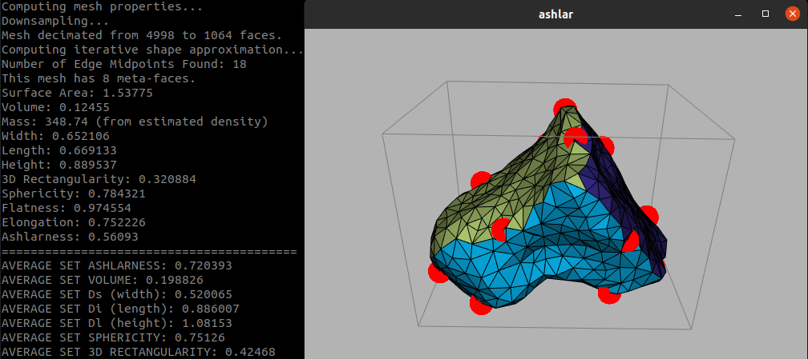
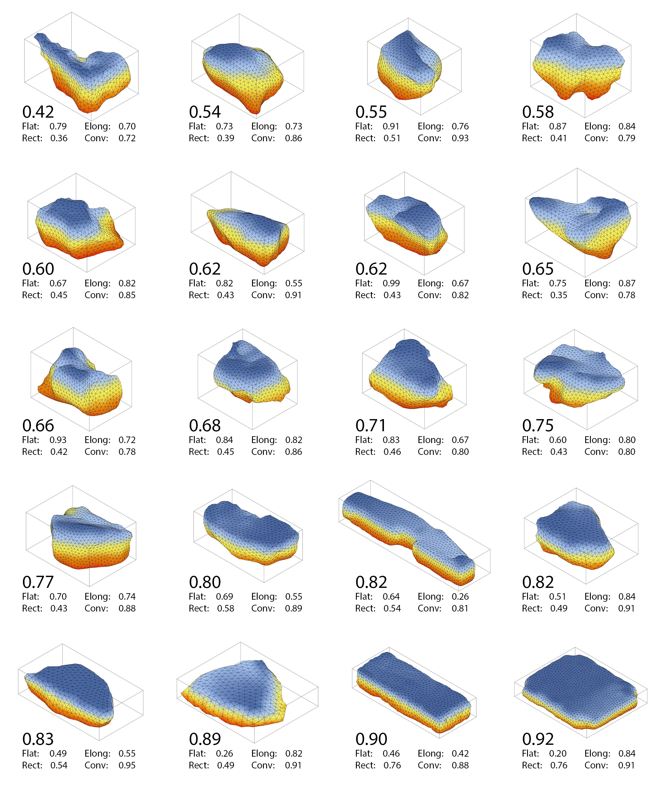

# Ashlar:  Mesh Properties for Stone Datasets

This repository is provided as a supplement to the paper _Multimodal Robotic Construction with On-Site Materials_.  
For closed triangular meshes (i.e. representing stones), we provide methods for computing meta-faces using iterative variational shape approximation, form and mass properties, and the ashlarness metric.

### _ashlar_ noun
[ash·lar | \ ˈash-lər  \](https://www.merriam-webster.com/dictionary/ashlar)
*1* :hewn or squared stone
_also_:masonry of such stone

## Dependencies
This project uses the geometry processing library [libigl](http://libigl.github.io/libigl/), 
and the only dependencies are STL, Eigen, libigl and the dependencies
of the `igl::opengl::glfw::Viewer` (OpenGL, glad and GLFW).
The CMake build system will automatically download libigl and its dependencies using
[CMake FetchContent](https://cmake.org/cmake/help/latest/module/FetchContent.html),
thus requiring no setup on your part.

## Compile

Compile this project using the standard cmake routine:

    mkdir build && cd build
    cmake ..
    make

This should find and build the dependencies and create the ``ashlar`` binary.

## Run

For computing the properties of a single stone, execute with the additional argument of the 3D triangle mesh file location.
For example, to use the provided sample mesh `923.obj`, execute:

```
./ashlar  ../mesh/923.obj
```

For processing many mesh files at once (i.e. to assess the volume, dimensions, and form properties of a dataset of stone models),
simply launch with a wildcard variable for all files in a specified directory:

```
./ashlar  ../mesh/*.obj
```

In both cases, the computed properties should print to the console, and a viewer will launch displaying the latest stone, with
colored meta-faces, edge midpoints, and bounding box (the mesh is reoriented using PCA).



### Output
At each run, the software should output a log file `logger.csv` in the main project directory which includes salient properties of each stone.
This can be useful, for example, for plotting or assessing the distribution of properties in a dataset of stones using external tools.
Note that this log file is overwritten at each run.

### File formats
Input files should be in one of the following formats:  obj, off, stl, wrl, ply, mesh

Models should be clean, closed triangle meshes of stone-like objects:  disjoint pieces, many duplicate vertices, etc. will likely cause issues.  
We assume the units are in meters (i.e. for mass properties), but in practice the majority of the other attributes are scale invariant.  
To speed up the meta-face estimation and for improved consistency with our existing dataset, 
we downsample the input mesh based on its volume and surface area prior to VSA computation (but after computing other geometric properties).
This [decimation](https://github.com/ryanlukejohns/ashlar/blob/cda7964fce1885534c28e6ed20d435afa1213811/src/stone.cpp#L275) is by default configured such that the mesh 
has approximately 500 faces per square meter if the stone were scaled to a volume of 1/3 m3.

### Meta-face Estimation
The face estimation relies on the iterative seed-and-flood approach of [Variational Shape Approximation](https://doi.org/10.1145/1015706.1015817), 
which attempts to find a distortion-minimizing set of $k$ meta-faces for a given triangle mesh.  In our case, we iteratively increment $k$ after performing
a maximum number of sub-iterations (default 10) per $k$ until a maximal $\mathcal{L}^{2,1}$ error metric has been achieved for all regions (default 0.26).
The process automatically returns at a maximal region count $k$ (default 25).

### Ashlarness
The [ashlarness](https://github.com/ryanlukejohns/ashlar/blob/cda7964fce1885534c28e6ed20d435afa1213811/src/stone.cpp#L113) value attempts to provide a more suitable metric for the "stackability" of a set of stones.  Given the estimated meta-faces of a stone with area $\mathit{A_s}$, 
and after aligning the stone to its approximate minimal bounding box (using PCA), we first identify a single broad meta-face whose area-weighted proxy
normal is most aligned with either of the two largest faces of the stone bounding box.  Using the area and unit normal of this meta-face as $\mathit{A_i}$ and $\mathbf{n_i}$, 
we iterate over the remaining meta-faces with respective areas and normals $\mathit{A_x}$ and $\mathbf{n_x}$ to find the single opposing face that produces the highest ashlarness value

$\arg \max_{x}\frac{1}{3}\big(\frac{\min\{\mathit{A_i},\mathit{A_x}\}}{\max\{\mathit{A_i},\mathit{A_x}\}}{+}\frac{\mathit{A_i}+\mathit{A_x}}{\mathit{A_s}}{+}(\mathbf{n_i} \cdot \mathbf{n_x})^2 \big)$

As such, stones with two parallel faces that are equivalent in area, and whose combined area makes up a large percentage of the total stone area have higher ashlarness (range 0-1).  A visual distribution
of the typical value range for this metric can be found in the below image from our paper:


### Local libigl
To use a local copy of libigl rather than downloading the repository via FetchContent, you can use
the CMake cache variable `FETCHCONTENT_SOURCE_DIR_LIBIGL` when configuring your CMake project for
the first time:
```
cmake -DFETCHCONTENT_SOURCE_DIR_LIBIGL=<path-to-libigl> ..
```
When changing this value, do not forget to clear your `CMakeCache.txt`, or to update the cache variable
via `cmake-gui` or `ccmake`.

## References
If using this repository for academic work, we thank you for citing [Multimodal Robotic Construction with On-Site Materials]()

```
BibTeX information forthcoming
```

The [Variational Shape Approximation](https://doi.org/10.1145/1015706.1015817) approach for finding meta-faces is presented in

```
@article{10.1145/1015706.1015817,
author = {Cohen-Steiner, David and Alliez, Pierre and Desbrun, Mathieu},
title = {Variational Shape Approximation},
year = {2004},
issue_date = {August 2004},
publisher = {Association for Computing Machinery},
address = {New York, NY, USA},
volume = {23},
number = {3},
issn = {0730-0301},
url = {https://doi.org/10.1145/1015706.1015817},
doi = {10.1145/1015706.1015817},
journal = {ACM Trans. Graph.},
month = {aug},
pages = {905–914},
numpages = {10}
}
```

[Mass properties](http://www.baecher.info/publications/spin_it_sup_mat_sig14.pdf) are computed using the method described in

```
@article{10.1145/2601097.2601157,
author = {B\"{a}cher, Moritz and Whiting, Emily and Bickel, Bernd and Sorkine-Hornung, Olga},
title = {Spin-It: Optimizing Moment of Inertia for Spinnable Objects},
year = {2014},
issue_date = {July 2014},
publisher = {Association for Computing Machinery},
address = {New York, NY, USA},
volume = {33},
number = {4},
issn = {0730-0301},
url = {https://doi.org/10.1145/2601097.2601157},
doi = {10.1145/2601097.2601157},
journal = {ACM Trans. Graph.},
month = {jul},
articleno = {96},
numpages = {10}
}
```

For the visualization of meta-faces, with non-overlappling colors, we use the four color implementation of [okaydemir](https://github.com/okaydemir/4-color-theorem), modified for a simplified eigen interface.

